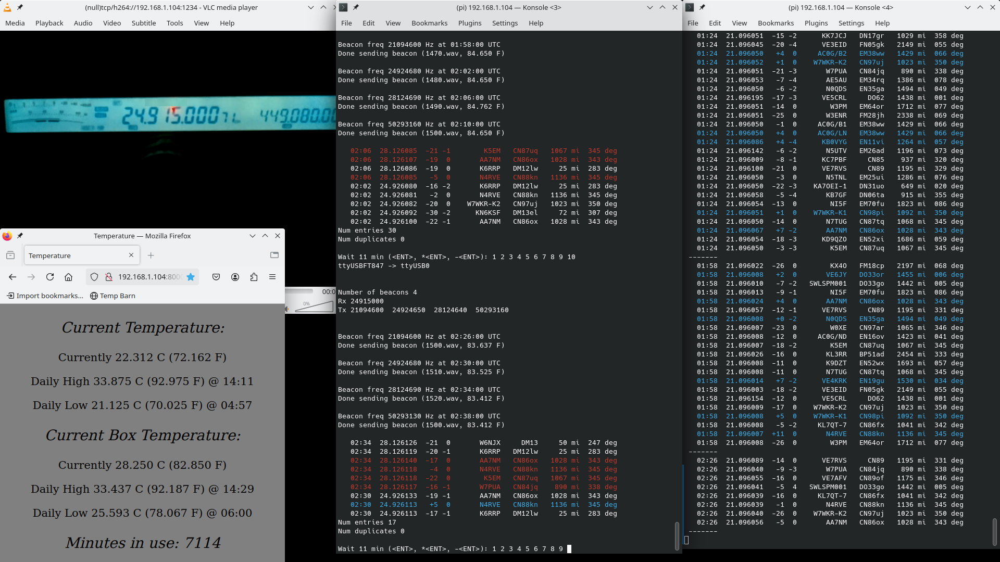

# twsprRPI
A C program to send out WSPR beacons and then display my reports from wsprnet.org.  Below is a typical screenshot of the program in operation.  More screenshots are in the doc/ directory.

This program is written specific to my needs.  It is not a general solution for everyone.  I'm placing this in the public domain so anyone can use all or part of it as they see fit, subject to the MIT license.

## Overview

This program sends out a WSPR beacon on 17m, 15m, 12m, 10m, 6m, and 2m.  The two minute beacons have two minute intervals between them.  It then waits two more minutes and goes to wsprnet.org and collects reception reports.  It parses and displays the results.  Any report greater than 0 dB is printed in BLUE, any report from more than 3000 miles away is in GREEN, and, when 10m is shutting down, all 10m reports in RED (wsprnet.c).

This process repeats every 28 minutes.  During the intervals between beacons the radio is set to monitor some other frequency.  The actual frequencies used are stored in WSPRConfig, a simple text file.

The program reads wav files and sends them out the sound card (wav_output3.c).  The files in this repository were generated using wspr0, a deprecated program.  WSJT-X and wsprd can also generate them.  For 2m and 6m the 1500Hz file is always chosen.  For other bands, it rotates through the files.

The radio is an old Yaesu FT847 (using ft847.c).  Obviously you will need to substitute a controller for your own radio or use one of the libraries out there.  (The FT847 had limited CAT control.  A modern radio would allow more interesting features to be added).

The program was originally written on an Ubuntu box and then moved to a Raspberry Pi (hence the RPI in the name).  There is no makefile.  This is the command used to build:
  
  gcc -g -Wall -o twsprRPI twsprRPI.c wav_output2.c ft847.c wsprnet.c azdist.c geodist.c grid2deg.c -lportaudio -lrt -lm -lasound -pthread
  
I've made no attempt at optimization.  The last three C files are translated from WSJT-X Fortran code, used to compute azimuth and distance.

Enjoy!

(Note on below screenshot - the two windows on the left show the program in operation.  The VLC window, upper left, and Firefox, lower left, are there because the station is remote.  I'm monitoring temperature and radio display.)

